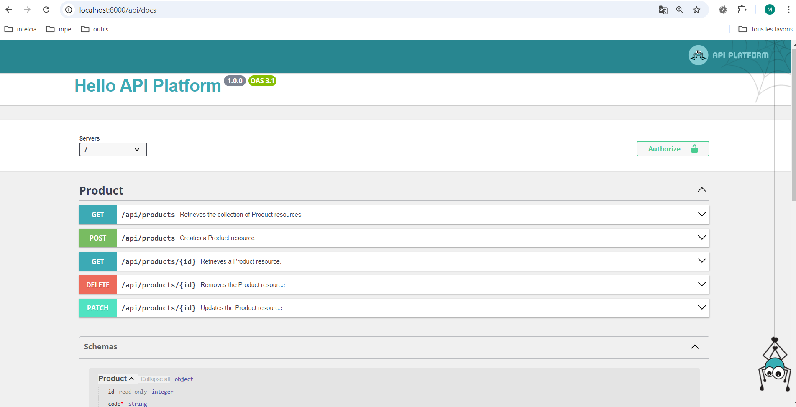

# Consignes

- Vous êtes développeur front-end : vous devez réaliser les consignes décrites dans le chapitre [Front-end](#Front-end)

- Vous êtes développeur back-end : vous devez réaliser les consignes décrites dans le chapitre [Back-end](#Back-end) (*)

- Vous êtes développeur full-stack : vous devez réaliser les consignes décrites dans le chapitre [Front-end](#Front-end) et le chapitre [Back-end](#Back-end) (*)

(*) Afin de tester votre API, veuillez proposer une stratégie de test appropriée.

## Front-end

Le site de e-commerce d'Alten a besoin de s'enrichir de nouvelles fonctionnalités.

### Partie 1 : Shop

- Afficher toutes les informations pertinentes d'un produit sur la liste
- Permettre d'ajouter un produit au panier depuis la liste 
- Permettre de supprimer un produit du panier
- Afficher un badge indiquant la quantité de produits dans le panier
- Permettre de visualiser la liste des produits qui composent le panier.

### Partie 2

- Créer un nouveau point de menu dans la barre latérale ("Contact")
- Créer une page "Contact" affichant un formulaire
- Le formulaire doit permettre de saisir son email, un message et de cliquer sur "Envoyer"
- Email et message doivent être obligatoirement remplis, message doit être inférieur à 300 caractères.
- Quand le message a été envoyé, afficher un message à l'utilisateur : "Demande de contact envoyée avec succès".

### Bonus : 

- Ajouter un système de pagination et/ou de filtrage sur la liste des produits
- On doit pouvoir visualiser et ajuster la quantité des produits depuis la liste et depuis le panier 

## Back-end

Développer un back-end permettant la gestion de produits définis plus bas.
Vous pouvez utiliser la technologie de votre choix parmi la liste suivante :

- Node.js/Express
- Java/Spring Boot
- C#/.net Core
- PHP/Symphony


Le back-end doit gérer les API suivantes : 

| Resource           | POST                  | GET                            | PATCH                                    | PUT | DELETE           |
| ------------------ | --------------------- | ------------------------------ | ---------------------------------------- | --- | ---------------- |
| **/products**      | Create a new product  | Retrieve all products          | X                                        | X   |     X            |
| **/products/:id**  | X                     | Retrieve details for product 1 | Update details of product 1 if it exists | X   | Remove product 1 |

Un produit a les caractéristiques suivantes : 

``` typescript
class Product {
  id: number;
  code: string;
  name: string;
  description: string;
  image: string;
  category: string;
  price: number;
  quantity: number;
  internalReference: string;
  shellId: number;
  inventoryStatus: "INSTOCK" | "LOWSTOCK" | "OUTOFSTOCK";
  rating: number;
  createdAt: number;
  updatedAt: number;
}
```

Le back-end créé doit pouvoir gérer les produits dans une base de données SQL/NoSQL ou dans un fichier json.

## Bonus

Vous pouvez ajouter des tests Postman ou Swagger pour valider votre API


# Instructions :
1 - Démarrer les conteneurs Docker
Accédez au répertoire backend et exécutez la commande suivante :

``` typescript
cd back && docker-compose up -d
```
2- Générer les données de fixtures
Utilisez la commande suivante pour générer les fixtures de produits :

``` typescript
php bin/console make:fixtures ProductFixtures
```
3- Accéder à la documentation de l'API
Une fois la configuration terminée, vous pouvez accéder à la documentation de l'API produit à l'adresse suivante : http://localhost:8000/api/docs

4 - Aperçu
Voici un aperçu de l'application :

